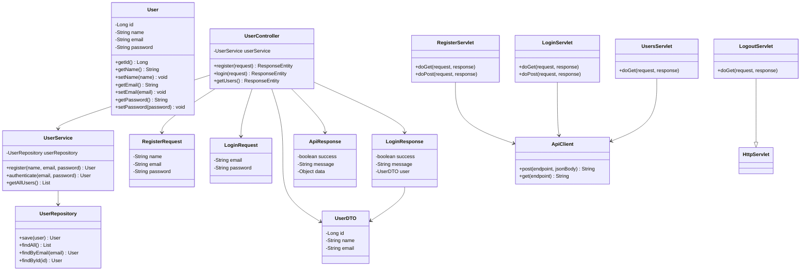

# UML Class Diagram - User Management System

## Architecture Overview

### Layers

1. **Database Layer**: PostgreSQL
   - Stores user data (id, name, email, password)

2. **Backend Layer** (REST API - Port 8090):
   - `UserController`: REST endpoints
   - `UserService`: Business logic
   - `UserRepository`: Database access
   - `User`: Entity model
   - DTOs: Data transfer objects

3. **Frontend Layer** (JSP - Port 8080):
   - `RegisterServlet`: Handles user registration
   - `LoginServlet`: Handles user login
   - `UsersServlet`: Displays list of users
   - `LogoutServlet`: Handles logout
   - `ApiClient`: Communicates with backend API
   - JSP Pages: User interface

### Data Flow

1. **Registration Flow**:
   - User fills form → RegisterServlet → ApiClient → Backend API → UserService → Database

2. **Login Flow**:
   - User fills form → LoginServlet → ApiClient → Backend API → UserService → Database

3. **View Users Flow**:
   - User navigates → UsersServlet → ApiClient → Backend API → UserService → Database

### Communication

- Frontend and Backend communicate via REST API (HTTP)
- Frontend makes JSON requests to Backend API endpoints
- Backend returns JSON responses
